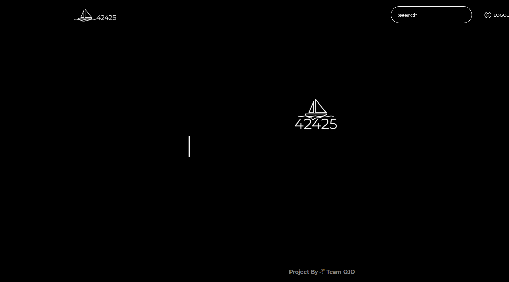
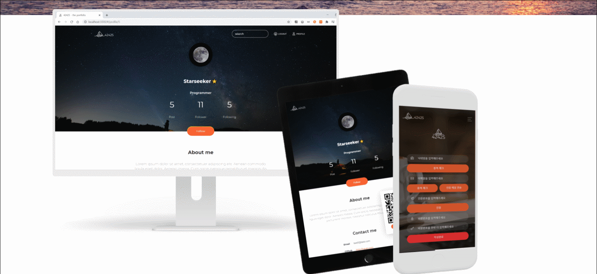
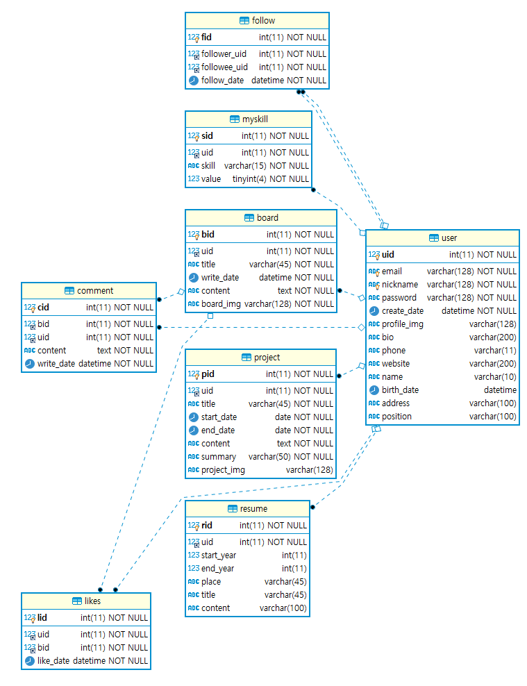
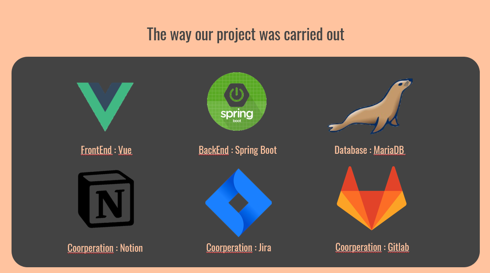

## 42425

개발자들을 위한 Blog

[배포링크] : http://i3d205.p.ssafy.io/#/

## 프로젝트 소개

> 취업을 위한 이력 관리, 기술 관리, 블로그 관리, 포트폴리오까지 한 번에!

42425는 자신의 이력관리, 포트폴리오 관리를 간편하게 관리 할 수 있는 블로그 입니다.

보기 좋고 쉽게 편집 할 수 있는 포트폴리오 프로필을 사용자에게 제공합니다.
간단한 블로그 기능과 커뮤니케이션 기능을 더하여 기술 블로그 운영이나 회원 간 소통이 가능합니다.

## **프로젝트 산출물**

- 프로젝트 계획서

- 와이어 프레임 및 계획안

- 발표자료

  

## ERD구성

## 개발스택 및 프레임 워크

Spring  *[Spring Boot](https://spring.io/projects/spring-boot)

 Vue.js *[Vue](https://vuejs.org/)

Visual Studio Code *[VSCODE](https://code.visualstudio.com/)

협업Tool *[swagger](https://swagger.io/tools/swagger-ui/) * [Jira](https://www.atlassian.com/software/jira/) * [Mattermost](https://mattermost.com/) * [GitLab](https://about.gitlab.com/)

Language  * [Java](https://java.com/ko/download/)

DB * [MariaDB](https://mariadb.org/)

Library  * [Spring boot](https://spring.io/projects/spring-boot/) * [Spring security](https://spring.io/projects/spring-security/)

etc. *[AWS](https://aws.amazon.com/ko/) *[Nginx](https://www.nginx.com/)

## Contact

[Samsung Software Academy for Youth](https://www.ssafy.com/) 3th Gumi, 공통프로젝트 D205

- Frontend Developer (gitlab and email)
    - 박도희- [@dohee.pa]([https://lab.ssafy.com/dohee.pa](https://lab.ssafy.com/dohee.pa)) - [dohee.pa@gmail.com](mailto:dohee.pa@gmail.com)
    - 허성수 - [@gjtjdtn201]([https://lab.ssafy.com/gjtjdtn201](https://lab.ssafy.com/gjtjdtn201)) - gjtjdtn201@gmail.com
- Backend Developer (gitlab and email)
    - 한정훈 - [@onooff]([https://lab.ssafy.com/onooff](https://lab.ssafy.com/onooff)) - [onooff77@gmail.com](mailto:onooff77@gmail.com)
    - 정성훈 - [@wtg1021]([https://lab.ssafy.com/wtg1021](https://lab.ssafy.com/wtg1021)) - wdtg10211@gmail.com
    - 김소희 - [@shttr6024]([https://lab.ssafy.com/shttr6024](https://lab.ssafy.com/shttr6024)) - [shttr6024@gmail.com](mailto:shttr6024@gmail.com)

Project Link: [https://lab.ssafy.com/s03-webmobile1-sub3/s03p13d205](https://lab.ssafy.com/s03-webmobile1-sub3/s03p13d205)